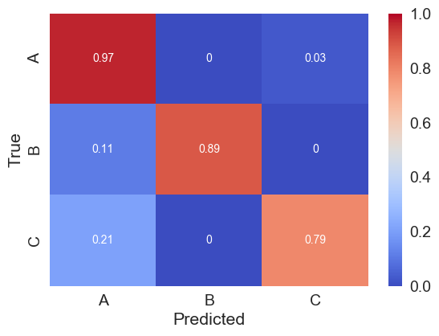

# Tools for working with (A)LSTM-FCNs

 - [About](#about)  
    - [Why](#why)  
 - [Quick run](#quick-run)   
 - [Components](#components)   
    1) [Preprocessor](#1-preprocessor)   
    2) [Generator](#2-generator-optional)  
    3) [Trainer](#3-trainer)  
    4) [Evaluator](#4-evaluator)  
    5) [Other classifiers](#5-other-classifiers)  
 - [Experiments and visualization](#experiments-and-visualization)  
    - [Plotting](#plotting-and-analysis)  
 - [Notes](#notes)  

# About

Culmination of several repositories:

- [time-series-preprocessor](https://github.com/sndean/time-series-preprocessor)
- [time-series-generator](https://github.com/sndean/time-series-generator)
- [LSTM-FCN-Jupyter](https://github.com/sndean/LSTM-FCN-Jupyter)
- [LSTM-FCN-trainer](https://github.com/sndean/LSTM-FCN-trainer) (the main, working repo) 

I'll probably keep these private, since they're in significantly worse shape than this repository.

## Why

To make it easier to process experimental data, generate synthetic data, and train a (A)LSTM-FCN model (and others) to classify time series or time series-like data. Some examples given are from the [UEA & UCR Time Series Classification Repository](http://www.timeseriesclassification.com/), including [ArrowHead](http://www.timeseriesclassification.com/description.php?Dataset=ArrowHead) and [Worms](http://www.timeseriesclassification.com/description.php?Dataset=Worms).

Also important: Every other dataset from [UEA & UCR Time Series Classification Repository](http://www.timeseriesclassification.com/) should also be able to be run through preprocessor, generator (if you like), and trainer with very little effort. The evaluator and plotting scripts should work fine as well.

# Quick run

As a minimal example, to see if preprocessor, generator, and trainer can be successfully run, try this.

First, install the required libraries (currently likely contains way too many, but it works...) from `notes/environment.yml`:

    conda env create -f environment.yml

Then 

    source activate keras
    cd LSTM-FCN-tools
    
    mkdir ../unedited_data
    cp example_data/ArrowHead.csv ../unedited_data
    
    python preprocessor.py -d ../unedited_data/ArrowHead.csv -p ArrowHead -c 0.3
    python generator.py -d ArrowHead -r 5 -b 2 -k 1 -i _TRAIN -o _EXP_TRAIN
    python trainer.py -d 1 -m 3 -r 1 -p ArrowHead -e 100
   

If there are any errors, then something is not set up correctly. If it finishes, then you've successfully just run trained an ALSTM-FCN on the ArrowHead dataset! Take a look at the figures and other files generated and saved in `figures` and `weights`. In the above example, the model is only trained for 100 epochs ... if the example works, maybe try setting `-e 1000`.

You should see a confusion matrix that looks something like this in `figures`:

### Adding another dataset

To add another dataset, using datasets within [UEA & UCR Time Series Classification Repository](http://www.timeseriesclassification.com/) as an example, download a file:

TODO

# Components

## 1. Preprocessor

The preprocessor generates a dataset that can be used directly as either input for 1) Generator or 2) Trainer. It takes a single input CSV (placed in `unedited_data`) and generates a train and test dataset for use downstream. The output `{prefix}_TRAIN` and `{prefix}_TEST` files are put in `../data`. (Note that `../data` exists a directory above this one, since it's potentially containing many large CSVs.)

### Arguments

    $ python preprocessor.py -h
    usage: preprocessor.py [-h] -d DATASETNAME [-v VERBOSE] [-p PREFIX] [-c PERCENT] [-u UPPERCATS]

    optional arguments:
    -h, --help            show this help message and exit
    -d DATASETNAME, --datasetname DATASETNAME
                            Dataset name (including path)
    -v VERBOSE, --verbose VERBOSE
                            Verbose or not
    -p PREFIX, --prefix PREFIX
                            Prefix to dataset
    -c PERCENT, --percent PERCENT
                            Percent dataset split (training)
    -u UPPERCATS, --uppercats UPPERCATS
                            Relabel with upper-level category         

Examples:                           
                            
    $ python preprocessor.py -d ../unedited_data/ArrowHead.csv -p 'ArrowHead'
    $ python preprocessor.py -d ../unedited_data/Worms.csv -p 'Worms' -c 0.4

## 2. Generator (optional)

This step is optional, but generally useful -- at least it is in the real world using small-ish experimental (a single person is actually generating the data) datasets. However, sometimes, even in that situation, it doesn't improve the ability of the model to learn.

The generator uses techniques useful for generating new time series data from your existing dataset (the output from the preprocessor) found in `data`. The process is described at length in this [article](https://oguzserbetci.github.io/generate-time-series/). For my own run through of the generator and its testing, look [here](/testing/generator.md).

### Arguments

    $ python generator.py -h
    usage: generator.py [-h] [-d DATASETNAME] [-r N_REPS] [-b N_BASE] [-k K] [-s SSG_EPOCHS] [-i INPUT_SUFFIX] [-o OUTPUT_SUFFIX]

    optional arguments:
    -h, --help            show this help message and exit
    -d DATASETNAME, --datasetname DATASETNAME
                            Datasetname
    -r N_REPS, --n_reps N_REPS
                            # iterations
    -b N_BASE, --n_base N_BASE
                            # data-points to average to creating new data point
    -k K, --k K           # iterations for K-means clustering
    -s SSG_EPOCHS, --ssg_epochs SSG_EPOCHS
                            # iterations for mean calculation with SSG
    -i INPUT_SUFFIX, --input_suffix INPUT_SUFFIX
                            Suffix for file to be extended
    -o OUTPUT_SUFFIX, --output_suffix OUTPUT_SUFFIX
                            Suffix for created files

Examples:

    $ python generator.py -d ArrowHead -r 5 -b 2 -k 1 -i _TRAIN -o _EXP_TRAIN
    $ python generator.py -d Worms -r 5 -b 2 -k 1 -i _TRAIN -o _EXP_TRAIN

## 3. Trainer

Training the model. LSTM, FCN, LSTM-FCN, or ALSTM-FCN are selected by setting `-m` to `0`, `1`, `2`, or `3`, respectively. 

Note that `trainer.py` will require modification of `utils/constants.py` if new datasets are added.

### Arguments

    $ python trainer.py -h
    Using TensorFlow backend.
    usage: trainer.py [-h] -d DATASETINDEX [-m MODEL_NUM] [-r RUN_TRAINING] [-p PREFIX] [-e EPOCHS] [-b BATCH_SIZE] [-l LSTM_CELL_NUM]

    optional arguments:
    -h, --help            show this help message and exit
    -d DATASETINDEX, --datasetindex DATASETINDEX
                            Dataset index
    -m MODEL_NUM, --model_num MODEL_NUM
                            LSTM, FCN, LSTM-FCN, or ALSTM-FCN
    -r RUN_TRAINING, --run_training RUN_TRAINING
                            Run training or not
    -p PREFIX, --prefix PREFIX
                            Prefix to dataset
    -e EPOCHS, --epochs EPOCHS
                            Epochs for training
    -b BATCH_SIZE, --batch_size BATCH_SIZE
                            Batch size for training
    -l LSTM_CELL_NUM, --lstm_cell_num LSTM_CELL_NUM
                            Number of LSTM cells

Examples:

    $ python trainer.py -d 1 -m 2 -r 1 -p 'ArrowHead' -e 500 -b 32
    $ python trainer.py -d 3 -m 2 -r 1 -p 'Worms' -e 200 -b 128

## 4. Evaluator

Evaluate the model

### Arguments

    $ python evaluator.py -h
    Using TensorFlow backend.
    usage: evaluator.py [-h] [-d DATASETINDEX] [-p PREFIX] [-m MODEL_NUM] [-s SAMPLE_NAME]

    optional arguments:
    -h, --help            show this help message and exit
    -d DATASETINDEX, --datasetindex DATASETINDEX
                            Datasetindex
    -p PREFIX, --prefix PREFIX
                            Prefix to dataset
    -m MODEL_NUM, --model_num MODEL_NUM
                            Relabel with upper-level category
    -s SAMPLE_NAME, --sample_name SAMPLE_NAME
                            Sample name (prefix of the file)

### Executable

Making a simple executable from `evaluator.py` is relatively simple. Install `pyinstaller` using `pip install pyinstaller` after running `source activate keras` (you need to be in the environment that successfully runs `evaluator.py`). Then, run `pyinstaller --onefile evaluator.py`. After a few minutes, you'll have `evaluator` in the `dist` directory. After this, you should be able to run `./evaluator` or double click the executable and have it run. So far I've only had this work well on the same OS that I've created it on (macOS), but am working on getting it to run on Ubuntu and Windows.

## 5. Other classifiers

### Linear discriminant analysis (LDA)

Python script for running LDA on whatever `datasetindex` & `prefix` you want.

#### Arguments

    $ python lda.py -h
    usage: lda.py [-h] -d DATASETINDEX [-p PREFIX] [-g GEN]

    optional arguments:
      -h, --help            show this help message and exit
      -d DATASETINDEX, --datasetindex DATASETINDEX
                            Dataset index
      -p PREFIX, --prefix PREFIX
                            Prefix to dataset
      -g GEN, --gen GEN     Use generated synthetic data or not (0 or 1)

### 1 Nearest Neighbor and Dynamic Time Warping (1NN-DTW) 

Python script for running an implementation of the 1 Nearest Neighbor (k=1) with Dynamic Time Warping classifier on whatever `datasetindex` & `prefix` you want, like the LDA script. This is based on, and code used from, [K Nearest Neighbors & Dynamic Time Warping by Mark Regan](https://github.com/markdregan/K-Nearest-Neighbors-with-Dynamic-Time-Warping), described by Xi et al. (see [here](http://alumni.cs.ucr.edu/~xxi/495.pdf) and [here](https://www.crcpress.com/Temporal-Data-Mining/Mitsa/p/book/9781420089769)).

#### Arguments

    python 1knn_dtw.py -h
    usage: 1knn_dtw.py [-h] -d DATASETINDEX [-p PREFIX] [-g GEN]

    optional arguments:
      -h, --help            show this help message and exit
      -d DATASETINDEX, --datasetindex DATASETINDEX
                            Dataset index
      -p PREFIX, --prefix PREFIX
                            Prefix to dataset
      -g GEN, --gen GEN     Use generated synthetic data or not (0 or 1)

#### Additional notes

Not provided in the Arguments for `1knn_dtw.py` (but could be) are the arguments for the `KnnDtw` function: `n_neighbors=1` and `max_warping_window=1`. Having `n_neighbors` set to 1 makes it *1NN* as the name suggests, so maybe don't alter that, but having `max_warping_window` set to 1 is the result of the algorthim/this Python implementation being **slow**. This value could be set higher, however, I've set it to 10 and, at least on the time series datasets I've been using, the classifier is not noticeably improved. So, I've left this as `=1`.

### Principal component analysis – support vector machine (PCA-SVM) 

Python script for running PCA-SVM on whatever `datasetindex` & `prefix` you want.

#### Arguments

    $ python pca_svm.py -h
    usage: pca_svm.py [-h] -d DATASETINDEX [-p PREFIX] [-g GEN]

    optional arguments:
      -h, --help            show this help message and exit
      -d DATASETINDEX, --datasetindex DATASETINDEX
                            Dataset index
      -p PREFIX, --prefix PREFIX
                            Prefix to dataset
      -g GEN, --gen GEN     Use generated synthetic data or not (0 or 1)

# Experiments and visualization

To allow for easier experimentation, there are shell scripts for optimizing LSTM cell number and batch size. Also, there's a script for generating data for ROCAUC analysis. 

Beyond these experiments, included are some Rmarkdown scripts for plotting data generated by these experiments (in a prettier form (in my opinion) than what's produced by matplotlib/seaborn).

## Plotting and analysis

### Plotting

`plotting.Rmd` plots the results from experimenting with optimizing LSTM cell number and batch size, including ROC curves and the AUCs of those curves, and the results from running those optimized models.

### Classification report

Generating plots and tables using the output from sklearn's [classification_report](https://scikit-learn.org/stable/modules/generated/sklearn.metrics.classification_report.html) function can be performed using `classification_report.Rmd`. The function's output is a table, like so:

                 precision    recall  f1-score   support

              A       1.00      1.00      1.00        11
              B       1.00      1.00      1.00         7
              C       1.00      1.00      1.00         2

    avg / total       1.00      1.00      1.00        20

In this case, the f1-score is likely the most useful piece of information. The f1-score is the harmonic average of the first two columns (precision and recall), where the best value is 1 (perfect) and 0 is the worst. `classification_report.Rmd` will take the results from repeated training-test splits and multiple models.

### Evaluator output

The script for plotting the output from evaluator (on a set of samples) is `evaluator_output.Rmd`. This will take in multiple `.txt` files printed from `evaluator.py`, such as:

           Probability
    Label
    A            0.937
    B            0.039
    C            0.024
    
concatentates and compares to what the expected (True) label is.

### Confusion matrices

For plotting the output of `pd.crosstab` in `trainer.py` (put in `weights/`) you can use `conf_mat_plotting.Rmd` which uses `ggplot2`'s `geom_tile()` to generate a good-looking confusion matrix. 

# Notes

Notes detailing environment setup, preprocessing datasets, generate synthetic time series, LSTM-FCNs, and others are in the [Notes](notes/README.md) section. 

Some of the code in this repository comes from other repos, including [titu1994's LSTM-FCN
](https://github.com/titu1994/LSTM-FCN) and [markdregan's K-Nearest-Neighbors-with-Dynamic-Time-Warping
](https://github.com/markdregan/K-Nearest-Neighbors-with-Dynamic-Time-Warping).

     
   

