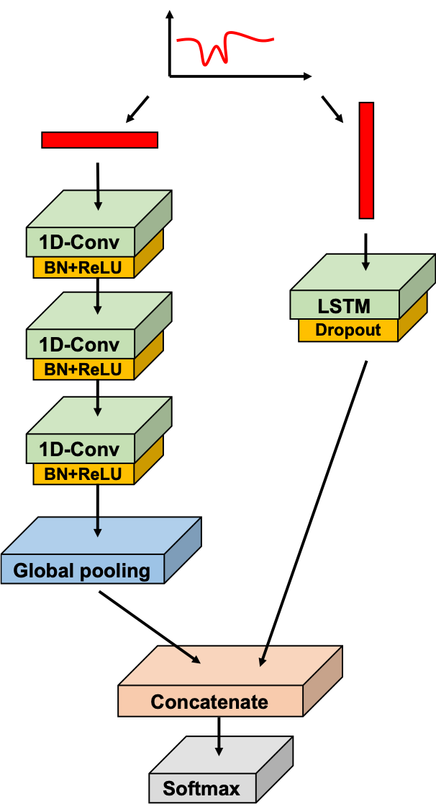

# Review of Karim et al. 2018

Versions of the LSTM-FCN paper can be found [here on arXiv](https://arxiv.org/abs/1709.05206) and [here on IEEE Xplore](https://ieeexplore.ieee.org/document/8141873). 

## Introduction

Karim et al. [1] demonstrates the use of LSTMs in conjunction with fully convolutional networks (FCNs) for classification of time series.

There is a lot of general interest in time series classification. Given the ubiquitous nature of time series or time series-like data and the importance of these datasets for decision making, such as buying or selling or chemical detection. See the [UEA & UCR Time Series Classification Repository](http://www.timeseriesclassification.com/) for examples of things that can fall under the umbrella of "time series dataset" (traces of the shape of the tips of arrowheads... that data is formatted the same as a more normal time series). Due to time series' importance to many fields, a large number of techiques have been applied to improve their classification.

One technique is fully convolutional networks (FCNs), a deep learning approach that take advantage of convolutional neural networks (CNNs) for end-to-end classification of univariate time series. Importantly, FCNs do not require a large amount of preprocessing of the data prior to training.

In their paper, Karim and Majumdar et al. pair LSTMs (and LSTMs with attention (ALSTMs)) with FCNs to improve performance on the [UCR dataset](http://www.timeseriesclassification.com/). These pairings are called LSTM-FCNs or ALSTM-FCNs. 

## Background work and (A)LSTM-FCN

FCNs used for time series classification have been described by [Wang et al.](https://arxiv.org/pdf/1611.06455.pdf). FCNs (comprised of temporal convolutions (see [here](https://arxiv.org/pdf/1608.08242.pdf))) are used to extract important features and global average pooling is used prior to classification to reduce the number of parameters. See the bottom half of Figure 1 from the paper to see its architecture: The FCN block is composed of three stacked temporal convolutional blocks with filter sizes of 128, 256, and 128, identical in CNN architecture to that described in [Wang et al.](https://arxiv.org/pdf/1611.06455.pdf). Each block is accompanied by batch normalization (momentum of 0.99, epsilon of 0.001) and followed by a ReLU activation function.

For construction of the LSTM-FCN, the time series input is, at the same time, pushed through a dimension shuffle layer, transforming the time series. The transformed data is then put into a LSTM (or ALSTM) layer, followed by a large dropout layer. The output of the global pooling layer of the FCN and the LSTM block are then concatenated and passed onto a softmax classification layer, output normalized probabilies leading to classification.

The dimension shuffle layer done via [Permute](https://keras.io/layers/core/#permute), where for the FCN the input data's dimensions are flipped relative to what's put into the LSTM. 

### Visualization

#### History

Noisy accuracy values?

#### Regions that contribute to class

##### Context vector of the Attention LSTM module

Importantly, the Attention mechanism of (A)LSTM can also be used detect regions of the input sequence that contribute to the class label through the context vector of the Attention LSTM cells. 

##### Class activation map of the final convolution layer

The class activation map of the final convolution layer is provided by the FCN block.

#### Plots to show diagnostic ability

##### Confusion matrix

Confusion matrices are tables that allows for visualization of the performance of an algorithm for classification.

##### ROC curve

Receiver operating characteristic (ROC) curves are plots used to show the diagnostic / classification ability of a model. 

https://en.wikipedia.org/wiki/Receiver_operating_characteristic

Area under the curve (AUC) relationship with ROC curves

https://www.r-bloggers.com/calculating-auc-the-area-under-a-roc-curve/

## Experiments

## Conclusions

## References

[1] Karim, F., Majumdar, S., Darabi, H., & Chen, S. (2018). LSTM fully convolutional networks for time series classification. IEEE Access, 6, 1662-1669.

